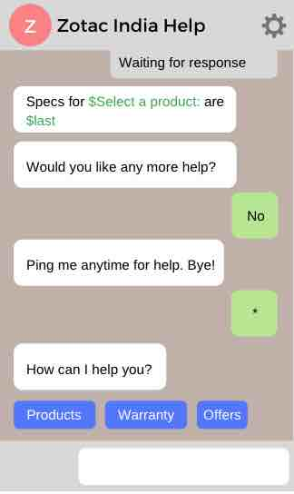
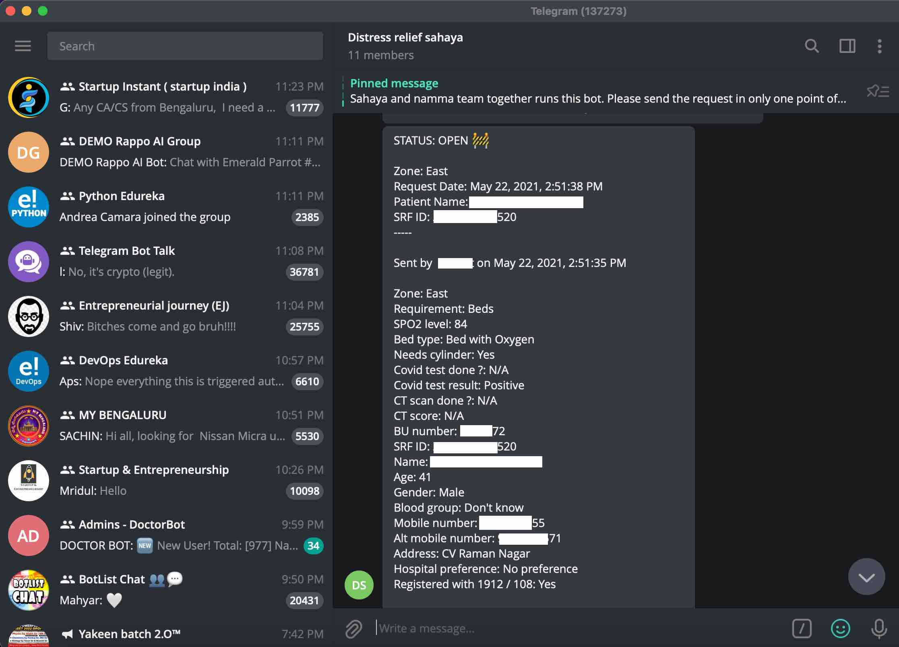
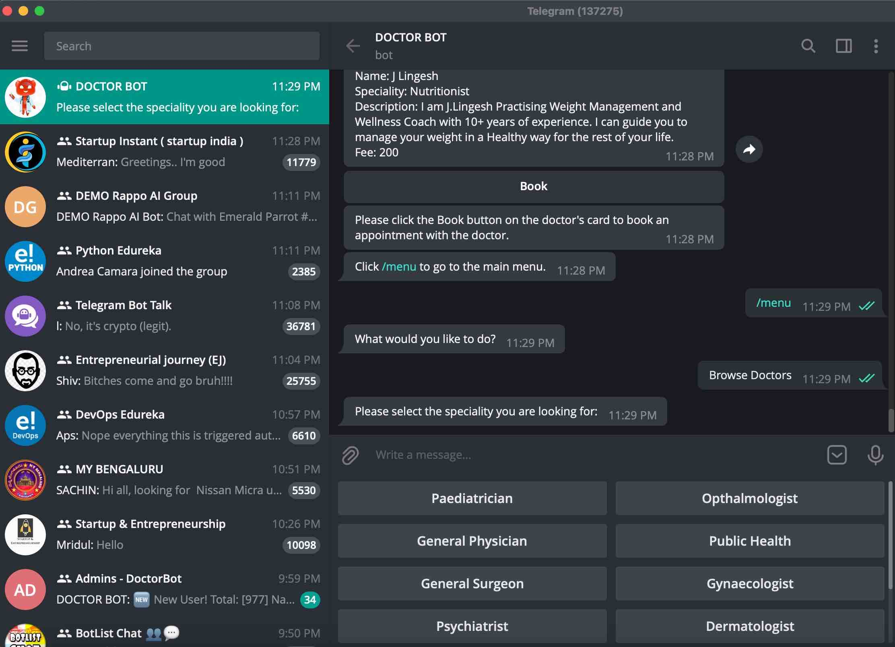
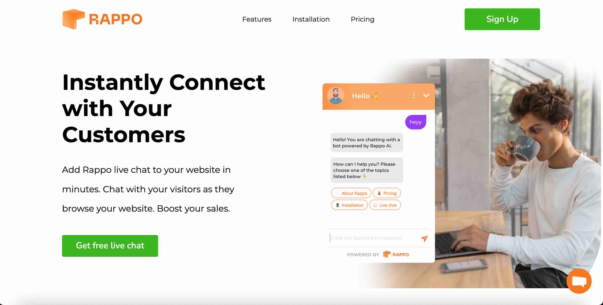
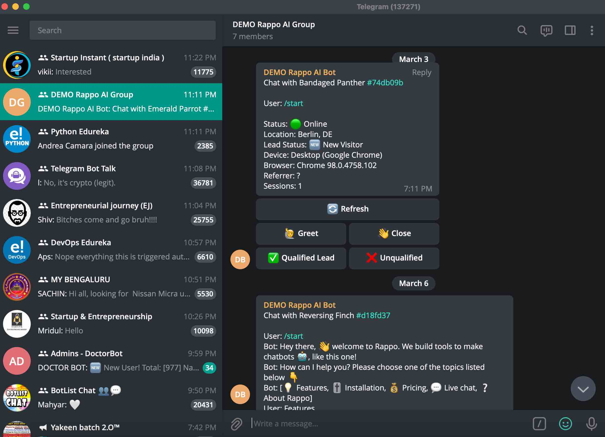

  
  
  
  
  

Rappo was a venture where the goal was to build a platform where anyone could easily create a chatbot. It started with a ReactJS prototype of a conversational GUI to build simple chatbots ([GitHub link](https://github.com/rappo-ai/editor-web-app)). Then Covid happened and we built a Telegram chatbot for a volunteer organization that was helping people in an emergency situation ([GitHub link](https://github.com/rappo-ai/distress-bot)). After this we got some commercial interest from a client to build a [Telegram tele-consultation chatbot](https://t.me/Doctor70_bot) for their userbase. Finally we explored an idea of using Telegram to manage a [website live chat service](https://rappo.renzil.com).

All source code is open-sourced and available on [GitHub](https://github.com/rappo-ai).
