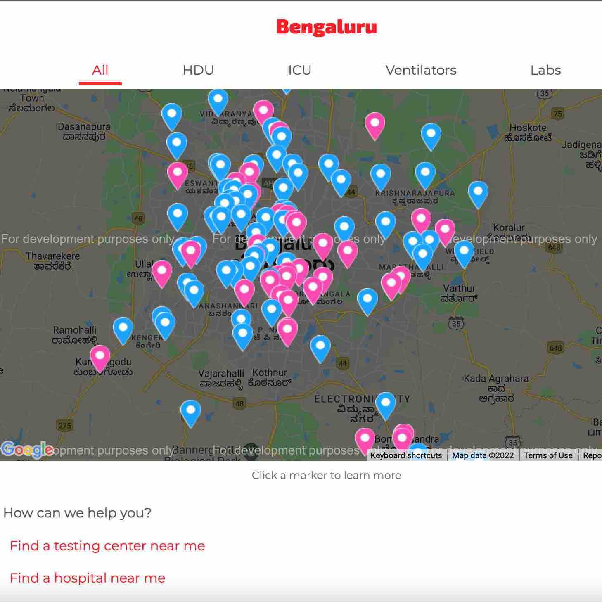

In 2020 when COVID was at its peak, it was very difficult to find hospital beds across India. I live in Bangalore and the situation here was also pretty bad. To help citizens, the government had published a list of hospitals that were treating COVID along with their contact details. This list was tedious to search in an emergency, and did not contain the critical information of hospital bed availability.

So I thought, what if I took this list and put it on a Google Map? Wouldn't that make it easier to find a hospital nearby? Also why not display real-time availability of hospital beds directly on the map? All the hospital needed to do was update their availability with a simple form.

I put this idea together over a weekend, and it became Hospital Tracker ([GitHub Link](https://github.com/covid-map)).

I then [wrote a post on Reddit Bangalore](https://www.reddit.com/r/bangalore/comments/hp8eoj/i_built_a_website_to_find_a_hospital_in_an/) that sort of went viral. It led to us forming a team of volunteers who tried our best to get accurate info from the hospitals. However that proved to be a challenge too steep, and a couple of weeks later the government released their own COVID bed availability tracker (without a map!).
