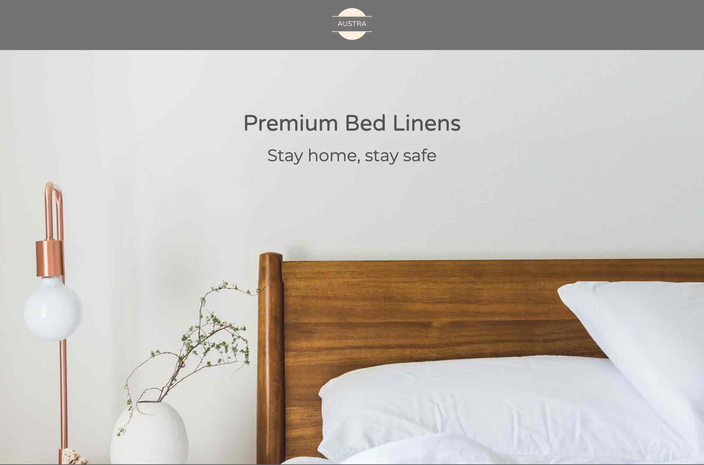

After Root Elements, I wanted to combine the skills I had learned creating and marketing a brand, with a business looking to hire those skills. I ran some LinkedIn ads and found a client based out of Ahmedabad who was intereted in launching a new brand of their cotton bedsheets.

Over the next 2 months I created the brand Austra and launched it on [web](https://australiving.com), [Facebook](https://www.facebook.com/australiving/) and [Insta](https://www.instagram.com/australiving/). I also created brochures for the customer to distribute to his existing customer base.
