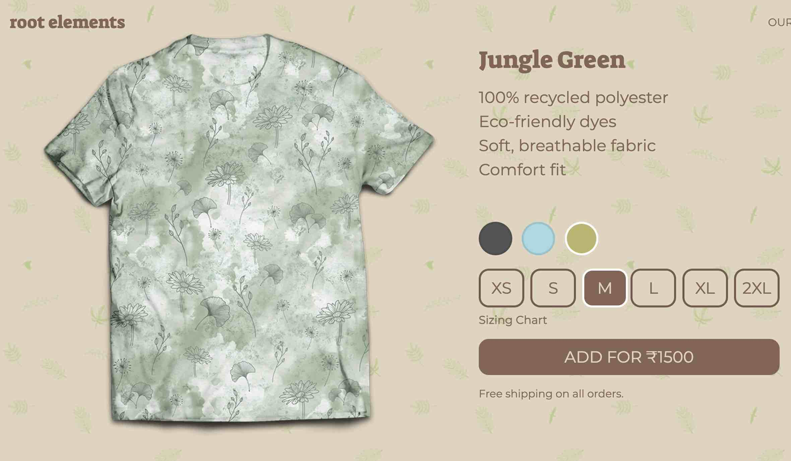

When I quit my job and started exploring ideas, one of the first things that interested me was sustainability. I really wanted to help reduce garbage going to landfills and improve recycling.

[Root Elements](https://rootelements.renzil.com) was an idea to recycle used PET bottles and make cool t-shirts out of them. The technology for recycling PET into polyester has existed for a while, but there weren't any brands dedicated to making clothing using these rPET fabrics.

As part of the market research, I ran Facebook ads varying the demographics, designs and ad copy to study user preferences and business feasibility. I wrote about my experiements and conclusions [here](https://startsmart.in/market-validation-for-an-e-commerce-apparel-startup-in-india/).

Source: <a href="https://github.com/renzil/rootelements"><i class="large github icon "></i>renzil/rootelements</a>
